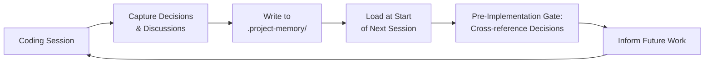

# Project Memory Skill

> **From the author:** Ever caught yourself scratching your head?
> - Why did we build this authentication system this way? If I change it like this, what would it cost across the codebase?
>
> Or,
> - Damn, the change I made broke 5 of my modules — I wish I hadn't forgotten why I needed to protect this socket structure before changing it...
>
> I'm a developer who works on long-running projects. There's not one of us who hasn't run into situations like the above. Is there anyone who can instantly recall how a decision made a year ago affects today's implementation?
>
> I built this project to solve exactly this problem for myself. It takes notes in the background while I work, captures the decisions I make, and warns me when needed — when I'm designing a new feature, changing code, doing a bugfix, and so on.
>
> The core focus of this tool is that problem. A few additional features orbit around it that might help me with the same problem. That's all... A simple idea, a simple implementation.
>
> I hope you find it useful too.

A memory and context skill for agentic coding — coding with an AI assistant. The skill runs silently at session start, loads engineering context, and takes notes in the background while you work.

Git already tracks what changed, where, when, and what the diff looks like. What it can't tell you is *why* it was changed, what alternatives were rejected, what constraints existed, what tensions are unresolved, what approaches have proven harmful, and what should happen next. That is what this skill is for.

The skill watches quietly and only steps in when it really matters. The rest of the time it takes notes in the background: the discussions you had about how to approach a problem, the decisions you made and why, what you built and when.

When you need something — *"What did we decide about the auth layer last month?"*, *"Why are we doing persistence this way?"* — just ask. The skill will find it.

And if you are about to do something that conflicts with a previous decision, the skill will give you a heads-up. If you still want to go ahead, no problem — you can change your mind. The point is to make sure it is a conscious choice, not an accident.

The skill uses its own judgment about what is worth surfacing and what is not. But its read will not always match yours. If something you talked about feels important and the skill has not picked up on it — or the other way around — just say so. It will act on it.

Here is how the memory loop works:

---

## Remembering your preferences

You can also tell the skill how you like to work:

> *"From now on, always create a dedicated branch before I start coding."*
> *"Remind me to write tests before touching any existing feature."*

The skill will follow these automatically, every session, without reminders. Your preferences stay personal — they are scoped to you and will not affect the rest of the team.

## Private notes

Need to jot something down mid-session? Just say so:

> *"Take a note: the staging deploy is flaky on Tuesdays."*

The skill will save it privately — only you can search your own notes. No status workflows, no ceremony, no audit noise. Pure personal scratchpad that persists across sessions.

---

## Installation

Copy the skill files into a directory in your project. A path like
`.claude/skills/project-memory/` works well.

> The skill will create a `.project-memory/` directory in your own project the
> first time you work together. Do not copy it from another project — yours
> will get its own fresh one automatically.

Then tell your agent:

> *"Run Project Memory Skill first thing every session."*

Do not forget to tell it where the skill lives — without a path, it will not
know where to look.

Want the skill available across all your projects instead of just one? Here is a
guide for setting that up on every major platform: → [INSTALLATION.md](INSTALLATION.md)

---

**MCP Server**

The skill works better with its companion MCP Server — faster, cheaper, smarter recall.
If you want it, just say so:

> *"Install the MCP Server."*

The skill will take care of it. If you would rather do it yourself: → [mcp-server/INSTALL.md](mcp-server/INSTALL.md)

One concrete thing the MCP Server changes: **drift audits stop costing you tokens
and time.** Without it (in the `standard` profile), each session's audit runs by
having the agent issue Glob/Read calls, reason over each finding, and write fixes
token-by-token — the rules are deterministic, but every pass draws on the LLM.
With the MCP Server installed, the audit is *deterministic, instant, and runs in a
background worker* — the skill calls `run_audit`, gets an immediate ack, and moves
on. The server runs the entire pipeline (`run_audit → apply_audit_fixes → re-run
until clean`) silently, applying all fixes with zero further involvement from the
agent. No tokens spent on audit, no LLM judgment, no latency added to your session.

---

## Usage

No commands to learn. Just ask naturally:

- *"What did we decide about X?"*
- *"Why are we doing it this way?"*
- *"Did we ever consider Y?"*
- *"What have we been working on lately?"*

---

## Profiles

Not every project needs the same level of ceremony. When you first work with the skill
on a new project, it will ask you to choose one:

- **standard** — lean ceremony: 8-category drift audit, 2 summary files
  (`roadmap.md` and `current-state.md`), Pre-Impl Gate with decision cross-reference.
  For projects where architectural reasoning matters.

- **minimal** — a `.project-memory/` directory with just `config.yml` and a single
  `MEMORY.md` inside. No ceremony — just running sections for roadmap, decisions,
  notes, and a log. For short or throwaway projects where git history alone is
  almost enough.

You can switch at any time — just say: *"Switch project-memory to minimal."*
Past artifacts are preserved; only future behavior changes.

**MCP companion server and profiles**

The MCP companion server is optional in all profiles, but how much you will miss
it varies quite a bit:

- **minimal** — MCP gives you some uplift, but honestly you will be fine without it.
  A single markdown file does not need a vector index.

- **standard** — strongly recommended. Without MCP, the per-session drift audit
  runs LLM-side — Glob/Read, reasoning, and fixes token-by-token. With MCP
  installed, audits become deterministic and instant: a background worker runs the
  full pipeline and applies all fixes with zero tokens and zero LLM judgment.
  Semantic search is also server-side. This is where the MCP Server earns its keep
  in `standard`. In short: everything still works without MCP — you just pay for it
  in tokens, wall-clock time, and LLM judgment where deterministic code would do the job.

---

## ADR support (optional)

Want a structured, human-readable record of architectural decisions — in standard
MADR format, compatible with ADR tooling? The skill can set that up.

Each time you make an architectural decision, the skill will create an ADR file for you.
After that, it is yours — edit it, annotate it, share it with your team. The skill
will not touch it again.

No rush, you do not have to decide upfront. Just ask whenever you are ready:

> *"Enable ADR support for this project."*

---

## Cost model

Being honest: sessions with the skill running will feel a bit token-heavy at
first, especially at the start of each one. That is the skill loading context —
doing its job. There is no point pretending otherwise.

But here is the claim worth making: over time, you will roll back less, chase
fewer bugs, and spend more of your sessions moving forward instead of backtracking.
The early overhead is the price of not re-learning the same lesson twice.

The skill cannot promise every session will be cheaper. It can promise the work will be.

---

## Manual audit

Not often. Once a month, maybe less.

The skill does its best to keep up automatically, but sometimes it gets confused too.
A small inconsistency unresolved. A tension not surfaced yet. A question it has been sitting with. A manual audit every
now and then gives the skill a chance to ask.

Just say: *"Let's run an audit."* The skill will walk you through what it found
and you will sort it out together.

No obligation but nice to have in order to keep everything in check.

---

## Under the hood

Curious how it actually works — audit categories, decision cross-reference,
MCP schema? → [UNDER_THE_HOOD.md](UNDER_THE_HOOD.md)

---

## License

MIT.